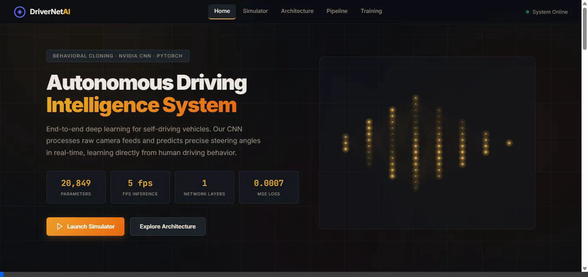

# DriverNet AI — Intelligent Autonomous Driving System



DriverNet AI is a deep learning–based autonomous driving platform designed to predict steering commands directly from road images. Inspired by modern end-to-end self-driving approaches, the system learns driving behavior from recorded human driving data and generates smooth steering decisions without relying on manually engineered rules.

## Key Highlights

* **Interactive Driving Simulation**

  * Explore real-time steering predictions through a browser-based simulator. Modify road conditions and curvature to observe how the AI adapts its driving decisions.

* **Deep Neural Network for Steering Control**

  * Utilizes a custom convolutional neural network implemented in PyTorch to identify road patterns, lane structures, and driving cues from visual input.

* **Enhanced Data Processing Pipeline**

  * Incorporates image preprocessing techniques such as region-of-interest extraction, resizing, color-space transformation, brightness variation, and spatial shifting to improve robustness under varying driving scenarios.

* **Training Performance Visualization**

  * Includes an interactive dashboard for monitoring training progress, optimizer behavior, and loss reduction throughout the learning process.

## Technology Stack

### Frontend

* HTML5
* CSS3
* JavaScript
* Canvas API

### Backend & AI Engine

* Python
* PyTorch
* OpenCV
* Flask (Optional Integration)

### Deployment

* Compatible with Vercel and other static hosting platforms

## Running Locally

The simulation interface can be launched without installing machine learning dependencies.

```bash
git clone <repository-url>
cd <repository-folder>

python -m http.server 8000
```

After starting the server, open:

```text
http://localhost:8000
```

in your browser to access the application.

## Deployment Guide

The project is structured as a lightweight web application and can be deployed quickly using Vercel:

```bash
npx vercel --prod
```

## Model Architecture Overview

1. Input Image (66 × 200 × 3)
2. Convolution Layer – 24 filters (5×5, stride 2) + ELU
3. Convolution Layer – 36 filters (5×5, stride 2) + ELU
4. Convolution Layer – 48 filters (5×5, stride 2) + ELU
5. Convolution Layer – 64 filters (3×3) + ELU
6. Convolution Layer – 64 filters (3×3) + ELU + Dropout
7. Fully Connected Layers – 1152 → 100 → 64 → 10 → 1
8. Output – Continuous Steering Angle Prediction

## Objective

The primary goal of DriverNet AI is to demonstrate how computer vision and deep learning can be combined to create an intelligent driving assistant capable of learning steering behavior directly from visual road data. The project serves as a practical example of behavioral cloning and end-to-end autonomous vehicle control.
